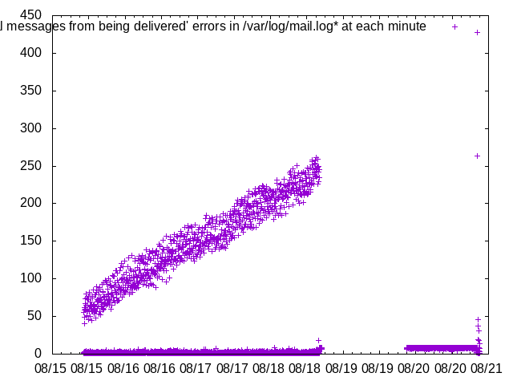
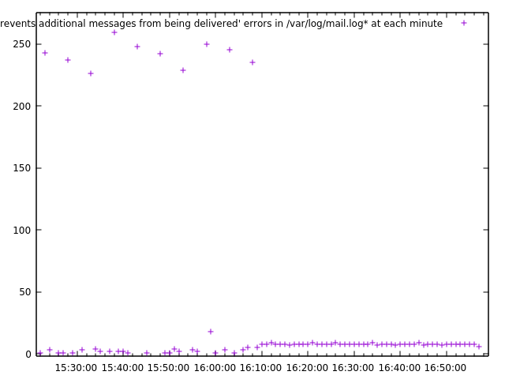
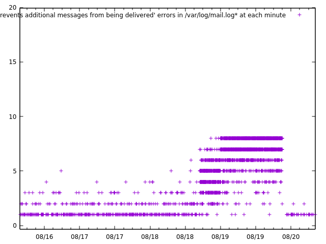

# Emails forwarding to Gmail got significantly delayed, and here is what
happened (and is still happening)

written by Taura

## What I experienced

On August 16 2018, I began to notice that some of my Emails to
[tau@eidos.ic.i.u-tokyo.ac.jp](mailto:tau@eidos.ic.i.u-tokyo.ac.jp) are
significantly delayed, for as long as hours and even a day. In several
conversations I was involved, I saw an Email quoting another reached me but
the quoted Email didn't, not even a while after that. This was how it caught
my attention.

## Background

I forward my Emails addressed at the laboratory's address (xxx@eidos...) to my
Gmail account and I read all Emails through Gmail web interface, as most our
members do. It is this forwarding that got delayed.

## A theory about what happened

Although what exactly happened in the beginning is not clear, one plausible
theory is Google rejects Emails to an account if it receives Emails too fast.
Specifically, according to [this
page](https://support.google.com/a/answer/1366776?hl=en), it starts to reject
Emails when an account receives more than 60 messages a minute.

### In the log

We had many lines of this error message in our mail server log
(orihime:/var/log/mail.log).

    
    
    Aug 20 20:23:25 orihime postfix/smtp[2088]: 859FA15E1A: to=<xxxx.xxxx@gmail.com>, orig_to=<xxx@eidos.ic.i.u-tokyo.ac.jp>, relay=alt1.gmail-smtp-in.l.google.com[64.233.179.26]:25, delay=92187, delays=92106/79/2/0.21, dsn=4.2.1, status=deferred (host alt1.gmail-smtp-in.l.google.com[64.233.179.26] said: 450-4.2.1 The user you are trying to contact is receiving mail at a rate that 450-4.2.1 prevents additional messages from being delivered. Please resend your 450-4.2.1 message at a later time. If the user is able to receive mail at that 450-4.2.1 time, your message will be delivered. For more information, please 450-4.2.1 visit 450 4.2.1  https://support.google.com/mail/?p=ReceivingRate i5-v6si6014457oii.19 - gsmtp (in reply to RCPT TO command))

The line appears to indicate that our server failed to forward a message
originally to my laboratory address to Gmail, which says the account is
receiving messages too fast.

I found more than 100000 lines of this error message (157784, to be precise).
Looking into the log, it turned out that this error message started to appear
at around 10:30 August 15 2018 and had lasted until August 18, at which point
I took an action, which by the way later turned out to be a bad one. I will
describe what I did at that time shortly. Here is the plot of the number of
this error message in every minute. Notice that the log file contains records
much earlier than that. It means there were literally no such messages before
August 15. Obviously, something happened on August 15.

### What are the two "clouds" in the plot?

In the plot, you see two "clouds", one growing over time until August 18, and
the other staying flat at the bottom. The growing one appears because we have
a spike of error messages every five minutes; meanwhile I keep receiving new
incoming messages, each of which obviously makes another error message (this
is what you see at the bottom, just like a "background" signal).

Here is an excerpt from the data showing the number of this error message in
the log, in every miniute. You see a clear spike every five minutes.

    
    
    Aug-16-15:08 134
    Aug-16-15:09 4
    Aug-16-15:11 2
    Aug-16-15:12 1
    Aug-16-15:13 125
    Aug-16-15:18 135
    Aug-16-15:20 2
    Aug-16-15:21 1
    Aug-16-15:23 119
    Aug-16-15:24 1
    Aug-16-15:25 1
    Aug-16-15:26 3
    Aug-16-15:28 136
    Aug-16-15:29 3
    Aug-16-15:31 1
    Aug-16-15:33 129
    Aug-16-15:36 2
    Aug-16-15:37 1
    Aug-16-15:38 138
    Aug-16-15:39 3
    Aug-16-15:42 1
    Aug-16-15:43 133
    Aug-16-15:44 1
    Aug-16-15:46 2
    Aug-16-15:47 1
    Aug-16-15:48 139
    Aug-16-15:53 113

### Why are the spikes growing over time?

The reason why we see a spike every five minutes is, presumably, that our mail
server (postfix) retries to send once-rejected messages every five minutes. I
confirmed our postfix configuration indeed does that.

    
    
    orihime:Maildir$ postconf | grep queue_run_delay
    queue_run_delay = 300s

Why is it growing over time? It is presumably because new Emails keep coming
and accumulate. One thing that I still don't understand is that postfix
document says it implements an exponential backoff for individual messages.
Here is an excerpt from qmgr manpage (man qmgr).

    
    
    deferred
                  Mail  that  could  not  be delivered upon the first attempt. The
                  queue manager implements exponential  backoff  by  doubling  the
                  time between delivery attempts.

If this is true, then even if new Emails keep coming, the number of messages
retried at each attempt should stay roughly constant (unless the number of NEW
messages is growing). This is a remaining mystery, but putting this aside, it
overall makes sense. That is, at one point around 10:30 August 15, I received
a surge of Emails (I don't know if it is an attack or just a coincidental
arrival of many SPAMs) and Google marked our server as forwarding Emails to my
account too fast; our server keeps retrying to send those deferred Emails
every five minutes, which, from the point of view of Google, looks like just
another influx of messages coming rapidly and therefore should be rejected as
well.

Google says on the [above
page](https://support.google.com/a/answer/1366776?hl=en) that once it starts
to reject incoming Emails from a server to an account, the rejection lasts 24
hours, after which it should start accepting them again. But as it is now
clear, our server continuously sends a growing number of messages every five
minutes, so it makes much sense that the problem persists, until an action was
taken.

This is an overall theory about what happened, except for two unknowns.

  * How it was exactly triggered (an attack? coincidental SPAMs?) 
  * Why does the number of messages retried every five minutes grow despite an exponential backoff? 

Now that the problem is fixed with the actions described below, I don't have
time to look into them. I will leave them for future work (translation: when
it happened again).

## Actions taken

### An attempt: send throttling

Based on the above reasoning, I thought the problem never disappears unless I
somehow "throttle" the sending rate of our server; if, every five minutes, it
tries to flush more than 60 messages, the Google will never terminate the
rejection. With that, I thought it is a good (and necessary) idea to limit the
sending rate to Google, for which I put the following in the config file
(orihime:/etc/postfix/main.cf)

    
    
    default_destination_rate_delay = 5s

and

    
    
    # service postfix restart

According to the [man page](http://www.postfix.org/postconf.5.html), this
limits the sending rate to a single domain (@gmail.com) to the specified rate
(which is one message every five seconds). I did it August 18.

This action took effect; as you can see in the plot, there are "spikes" in the
plot any more, after August 18. Here, I am zooming into the point around which
I did it.

In the right part of the graph, you see a window of time in which it receives
about 8-9 error messages per minute, after which all error messages of this
kind are completely gone. Receiving 8-9 error messages makes sense,
considering we are limiting the send rate to an Email per five seconds. The
reason why they disappear after a while remains mystery, but I observed that
Emails of another kind of error are being retried at that point. Here is the
plot of the number of following error messages in the log.

    
    
    Our system has detected that this message is 421-4.7.0 suspicious due to the nature of the content and/or the links within. ...

After the action was taken, we see 8 error messages per minute of this type,
which presumably means our server was focused on error messages of this type
at that point.

At that time, I thought I'll wait for 24 hours until Google will accept Emails
to my Google account and the case will be closed. But I started to realize the
problem actually got worse; it was that, not only Emails to me got delayed but
also Emails to all members start experiencing delays; sure, I didn't except
that MY problem will go away immediately, but what actually happened was that
it propagated the problem to all of our members. I tried to send a message to
a student's lab address but he couldn't receive it (at least not immediately).

As a hindsight, it is fairly obvious that it was not a right solution; it does
not take any sophisticated queueing theory to understand that, by limiting
Emails to Google to an Email every five seconds, we will have a growing queue
of delayed Emails, unless the entire laboratory collectively receives less
than an Email every five seconds, which seems unlikely.

Besides, at that time, I had a ton of deferred messages that wait to be
forwarded, so limiting the sending rate to Google prolongs the time it takes
to flush all of them.

### Dilemma

If I do not throttle the sending rate, the problem never goes away as our
server tries to send more than 60 Emails every five minutes to upset Google.
If I do throttle, on the other hand, the sending rate to, say, an Email per
every five seconds, it won't catch up the incoming rate of Emails to our
server, which will be higher than 1/5 Emails a second. A less restrictive
throttling, such as an Email per every second may be a right choice, but we
will still see an occasional delay when we are involved in a conversation over
lab's mailing list (almost everybody in our lab forwards their Emails to
Google). AFAIK Posfix offers no way to limit the number of Emails _per minute_
; it only allows us to specify an interval between two consecutive Emails.

### Removing SPAMs manually

A major reason why so many Emails are in our queue is SPAM. We don't need to
forward them to Gmail, obviously. They stand in the way of legitimate Emails
when I tried to forward them to Google with throttling.

So I decided to remove SPAMs in the deferred queue by myself, so that the
server starts sending legitimate Emails; this way, Emails not to me should be
immediately accepted by Google. The problem will at least become only mine.
Also, the number of deferred Emails hopefully gets below 60 after removing
SPAMs, which we can now safely send as fast as we want.

Emails waiting to be forwarded are in /var/spool/postfix/deferred/[0-9,A-F]/*
and

    
    
    postcat FILENAME

will allow you to look into an Email. Using

    
    
    postcat FILENAME | grep MY_EMAL_ADDRESS_AT_LAB

and other criteria, e.g.,

    
    
    postcat FILENAME | grep "Subject:" | grep "Viagra"

I was able to find Emails that are most likely to be SPAMs. Once an Email is
determined as a SPAM, we can delete it by

    
    
    postsuper -d MESSAGE_ID

I wrote a script that scans all Emails addressed to me and delete ones that
are most likely SPAMs. I put it in a loop that repeats doing this forever.

While I am doing this, I saw a number of deferred Emails went from more than
300 to below 50. At the same time, I observed Emails to me started to be
delivered! After all, I didn't have to wait for 24 hours; Google may be
thinking that "Oh, this guy finally stopped asking us to receive bogus Emails;
I am always happy to accept you as long as you don't bother me by SPAMs." I
don't know the truth, though.

## In case this happens again

If Google behaves consistently, the basic lesson I learned is, "just clean up
SPAMs in your deferred queue."

## An evidence that it happened on August 15

Here is the plot of the number of lines in every minute, found in our Email
server log saying:

    
    
    Our system has detected that this message is 421-4.7.0 suspicious due to the nature of the content and/or the links within. 421-4.7.0 To best protect our users from sp 32295 ...

There was indeed a huge surge of such lines and it climbed up to 60/min,
exactly around the time the Google starts rejecting Emails to my account.
Whatever they were, I am now pretty confident they triggered the incident and
they are not coincidental but an attack, considering the rate of message I
usually receive (including SPAMs).

## Is it only mine, or perhaps yours tomorrow?

Well, shame on me, I am receiving way too more SPAMs than all of you combined.
It may be because I am old and in early old days, people does not care about
putting your Email address on the web. I didn't closely examine SPAMs, but
apparently many Emails are addressed to

    
    
    crawl@logos.t.u-tokyo.ac.jp
    crawl@logos.ic.i.u-tokyo.ac.jp
    tau@logos.ic.i.u-tokyo.ac.jp

all of which are addresses I created around 2001, when exposing Emails on web
page as a plain text is a norm.

With that said, as the graph in the last section shows, even if I am receiving
way more SPAMs than younger folks, it is not so many that it may trigger
Google's rejection at ordinary times. A malicious attacker must be behind, and
if there is one, you may be the next.

Now I deleted the former two, which I hope will drop the probability of my
receiving an attack. I cannot remove the last one, as I still constantly
receive legitimate Emails at that address.

## Any actions needed?

I was inclined to think it is an urgent matter to install SPAM filter in our
server and apply it BEFORE it tries to forward Emails to Google. If the
incident we experienced happens whenever we see an occasional increase of
SPAMs, it would indeed be urgent. But if it happens only as a result of an
attack, we may hopefully assume it is rare. Looking at the number of SPAMs I
receive usually, I now think it's not such an urgent matter. Here is the
number of SPAMs that reached my Google SPAM folder in July of 2018 (that is 31
days).

  * 108 To: tau@eidos 
  * 31 To: [tau@logos.ic.i](mailto:tau@logos.ic.i)
  * 126 To: [tau@logos.t](mailto:tau@logos.t)
  * 153 To: [crawl@logos.ic.i](mailto:crawl@logos.ic.i)

The number certainly makes me uneasy, but on any account, 500 SPAMs in a month
is not high enough to warrant an immediate action. 60 Emails per minute, the
threshold above which Google starts rejecting Emails, is not something that
happens by chance.

Of course, having a SPAM filter is still worthwhile as it makes us robust
against an attack.

## Update 1 (2018/8/21)

I said above that there was a surge in the number of the following log entries
around August 15.

    
    
    Our system has detected that this message is 421-4.7.0 suspicious due to the nature of the content and/or the links within. 421-4.7.0 To best protect our users from sp 32295 ...

I tried to confirm that I was indeed receiving a huge number of Emails around
that time. I looked at my Maildir on our server, which stores all incoming
Emails no matter whether they are SPAM or not (am I correct on this?).

I did not see such a huge number of Emails around that time.

I still don't know why...

## Update 2 (2018/8/23)

I thought the case was closed but it wasn't.

I showed there was a surge before August 15 (when things got started) in our
mail log saying "... suspicious due to the nature of the content and/or the
links within. "

I thought there was an attack at that point, which causes our Email server to
try >60 messages a minute, which in turn causes Google to consider our server
is sending Emails too fast. And the problem persists because our Email server
keeps trying to resend them every five minutes. I removed them by myself and
Google started accepting legitimate Emails to me.

I thought the case was closed because I thought it was an attack sending >60
messages in a minute; I also thought attacks will be rare and there is little
I can do for attacks not to happen. Filtering SPAMs before trying to forward
them to Gmail is always a remedy but I did not consider it to be urgent.

However, the problem happened again, and again. Here is the number of the same
error messages until today.

Do you recall that I said it remains as a mystery why there is this surge, on
the contrary to my Maildir (the mail folder that stores all Emails that
reached orihime) not having such a huge number of messages in the same time
period? At that point, I left it as a mystery.

But now I observed surges three times and in each of them, I checked the
number of messages orihime received in the same period of time but saw no
accordingly large number of messages. I was forced to reconsider my hypothesis
that there was such an attack.

In retrospect, it may not be such a big mystery; suspicious Emails rejected by
Google will accumulate in our server and be retried too, in the same interval
of five minutes. If, for example, I receive >60 SPAMs in an interval of five
minutes, and all of them are retried the next time postfix flushes deferred
Emails, the problem certainly starts. Depending on the algorithm used by
postfix to retry deferred Emails, however, it may not take 60 mails in a
single five-minutes interval. SPAMs accumulating over a much longer period of
time may be enough to trigger the problem.

## So what to do?

It seems now clear that we (at least I) need to do something about it. The
problem itself is a bit stupid, as those Emails rejected by Google have no
chance to get through, so retrying them does not make much sense.

Having a SPAM filter to filter SPAMs before forwarding them to Google is one
way, but I am wondering if there is an easy way. Just configure postfix, so
that it discards Emails right after they are rejected as suspicious by Google.
It will solve 99% of the cases, except a (rare) case in which I really receive
>60 Emails in an interval of five minutes.

I am so far unable to find any such configuration. Meanwhile, I am
continuously running a script that does just that. It searches
/var/spool/postfix/defer folder (defer, not deferred), which holds the reason
why deferred Emails were deferred. There, I can find all Emails that are
rejected as suspicious and will be retried later. The script just deletes them
using postsuper -d command, as soon as it finds one. Neither hand-made nor
heavyweight SPAM filtering rules are necessary. It's simply deleting Emails
that could not be delivered anyways. Here it is:

    
    
    search_for_suspicious() {
        for f in $(grep -l 'suspicious due to the nature of the content and/or the links within' $(grep recipient=taura.kenjiro@gmail.com -l -r /var/spool/postfix/defer)); do
            postsuper -d $(basename $f)
        done
    }
    
    while :; do
        date
        search_for_suspicious
        sleep 20
    done

## Another remaining mystery

Why things started on August 15?

It's not that I was not receiving any SPAM before that. As I have shown above,
there were literally NO error messages complaining about this. There have been
"... suspicious ..." messages earlier than that. Why did they start causing
this problem from August 15 and onward?

Is it simply that SPAMs to me increased recently and exceeded the threshold
that triggered the incident? No, I don't think so. If this is the case, we
should have seen a smaller surge of "... suspicious ..." messages constantly
earlier than August 15, which just did not get high enough to exceed the
threshold. SPAMs will be eventually discarded (postfix says 5 days is the
default value until the message gets bounced or discarded).

Did something change in our server settings, so that it is now either more
generously accepting suspicious Emails or more aggressively resending deferred
messages?

## Now the mystery is solved, but the problem isn't

Continuing the investigation, next I examined the number of NEWLY ARRIVED
messages that are rejected by Google as "suspicious". Note that this is
different from the number of lines saying a message is rejected as suspicious
in the mail log; the latter includes the events in which a message is retried
(and rejected as before). Each line contains an internal message ID
(A82001902B of the following line), so we can judge if a line in the log
mentions a newly arrived message or a retry.

    
    
    Aug 18 00:01:18 orihime postfix/smtp[29444]: A82001902B: to=<taura.kenjiro@gmail.com>, orig_to=<tau@eidos.ic.i.u-tokyo.ac.jp>, ....

Here is the number of suspicious messages I received each DAY, from July 22 up
to today.

    
    
    Jul-22-00:00 5
    Jul-23-00:00 1
    Jul-25-00:00 12
    Jul-26-00:00 4
    Jul-27-00:00 4
    Jul-28-00:00 4
    Jul-29-00:00 2
    Jul-30-00:00 4
    Jul-31-00:00 1
    Aug-01-00:00 1
    Aug-02-00:00 2
    Aug-03-00:00 3
    Aug-04-00:00 2
    Aug-05-00:00 1
    Aug-06-00:00 1
    Aug-07-00:00 1
    Aug-08-00:00 2
    Aug-09-00:00 3
    Aug-10-00:00 3
    Aug-11-00:00 4
    Aug-12-00:00 138
    Aug-13-00:00 198
    Aug-14-00:00 276
    Aug-15-00:00 115
    Aug-16-00:00 80
    Aug-17-00:00 125
    Aug-18-00:00 1086
    Aug-19-00:00 822
    Aug-20-00:00 38
    Aug-21-00:00 364
    Aug-22-00:00 264
    Aug-23-00:00 149

Alas, starting from Aug 12, there was indeed an influx of suspicious Emails
arriving to me!

But you might wonder, "sure, something clearly happened at August 12, but
isn't it >60 Emails per five minutes that trigger the Google's rejection due
to the message rate? Is 198 Emails per day an issue at all? Did you see a
minute in which you received >60 Emails?"

Good question and you are right. As I said, Emails once rejected by Google are
retried when postfix schedules retrying deferred messages the next time. This
retry attempt happens every five minutes. After that, an exponential backoff
kicks in; if a message is still undeliverable at its first retry attempt, it
will be retried 10 minutes later, another 20 minutes later, another 40 minutes
later, and so on. If this exponential doubling of retry intervals continues
forever, the number of messages sent per a retry attempt SHOULD STAY AT A
CONSTANT, around 2 x the average number of newly arrived messages in a five-
minutes interval. For example, if suspicious messages keep coming at a rate of
10 messages per every five minutes, then the number of messages retried at a
single scheduled attempt should stay around 20 messages (10 + 5 + 2.5 + 1.25 +
...). Therefore 138 messages per day, or even 1086 messages per day, which is
still below a single message per minute, shouldn't be an issue at all.

Are you still with me? Here is the final piece of the puzzle. This doubling of
retry interval does not continue forever; it instead ends at 4000 seconds.
Here is the config that specifies it.

    
    
    orihime:Maildir$ postconf | grep max
    max_idle = 100s
    max_use = 100
    maximal_backoff_time = 4000s   <------------
    maximal_queue_lifetime = 5d
    smtpd_policy_service_max_idle = 300s
    smtpd_policy_service_max_ttl = 1000s

So, after a message failed to deliver at the first retry attempt, it will be
retried at 10 minutes later, another 20 minutes later, another 40 minutes
later, and another 70 minutes later, after which it will be retried EVERY 70
MINUTES (note that 4000s = 66 minutes 40 seconds, which rounds up to 70
minutes due to the 5-minutes period of retry attempts). Here is an evidence
from our log. A1B4615F98 is the ID of a message that gets
labeled as suspicious by Google.

    
    
    namopa:mail_log$ grep A1B4615F98 mail.log | awk '{ print $1,$2,$3 }'
    Aug 15 09:39:30
    Aug 15 09:48:17
    Aug 15 09:58:18
    Aug 15 10:18:18
    Aug 15 10:58:17
    Aug 15 12:08:17
    Aug 15 13:18:18
    Aug 15 14:28:17
    Aug 15 15:38:17
    Aug 15 16:48:17
    Aug 15 17:58:17
    Aug 15 19:08:18
    Aug 15 20:18:17

After it arrived at our server at Aug 15 09:39:30, it was retried at 09:48:17
for the first time. Then it was subsequently retried at 09:58:18 (+10 mins),
10:18:18 (+ another 20 mins), 10:58:17 (+ another 40 mins), 12:08:17 (+
another 70 mins), after which it was retried EVERY 70 MINS (13:18:18,
14:28:17, ...).

So, after a sufficient number of suspicious messages accumulate in our server,
on average 1/14 (I mean, 5/70) of them will be retried at each retry attempt.
Therefore it takes only 840 messages to guarantee that at least one of them
will send >60 messages.

Messages that enter deferred queue are deleted when they cannot be forwarded
in five days.

    
    
    orihime:Maildir$ postconf | grep max
    max_idle = 100s
    max_use = 100
    maximal_backoff_time = 4000s
    maximal_queue_lifetime = 5d   <------------
    smtpd_policy_service_max_idle = 300s
    smtpd_policy_service_max_ttl = 1000s

So, roughly speaking, if I receive more than 840 suspicious messages in five
days, it will trigger the incident.

Now what happened is pretty clear and we also know it is not one off. It is
still happening ...

The next stage may be examining why and where they are coming ...

Currently, as I mentioned, my ad-hoc mechanism is in place to remove
suspicious messages as soon as they arrive. So I think I am currently safe,
but it still gets me very nervous. If there is a config change to postfix that
makes it not to happen or there is a SPAM filter that prevents suspicious
messages from being forwarded, I would feel much better.

