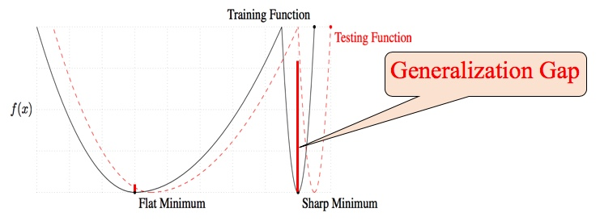

# Analysis of Large Mini-Batch Training of Neural Networks

The neural network models are becoming complex and the datasets are growing
bigger. For instance, the number of layers increased from 8
(AlexNet) to 152 (Residual Nets) just over a period of 4
years. ResNet50, which has just 50 layers, has approximately
25 million parameters. Moreover, the size of the dataset has also increased
dramatically. ImageNet has 1.28 million training images and
150,000 test images, all classified under 1000 classes. Training such complex
networks with massive dataset takes days or weeks. For example, training
GoogleNet by ImageNet dataset on one
NVIDIA K20 GPU takes 21 days.

One of the most commonly used technique to speed up the training of the deep
neural network (DNN) is large mini-batch training. Table 1 summarizes the
speed-up reported by various teams for training ResNet50 on
ImageNet dataset. Akiba et al. were able to train in 15
minutes by using an extremely large minibatch of size 32,768. However, this is
not even 3% of the total dataset size which is 1,28 million in case of
ImageNet. On further increasing the mini-batch size, they
found degradation in the performance of the model. In general, a model trained
with large mini-batch has been found to lose its generalization ability even
if trained "without any budget or limits, until the loss function ceased to
improve". This phenomenon of decrement in the performance is known as
generalization gap.

Having an insight into the origin of generalization gap, and moreover,
discovering ways to close the gap will have significant practical importance.
Particularly, it will help to improve the parallelism of the deep neural
network which demands the use of very large mini-batch.

The empirical findings of Keskar et al. suggest that the origin of
generalization gap can be attributed to sharp minima Figure 2. They found that
models trained with large mini-batch had sharp minima and generalized poorly
while the models trained with small mini-batch had at minima and generalized
well. The reason why models trained using large mini-batch end up in sharp
minima is still unknown. However, much research has been done in order to
prevent a model from falling into sharp minima.

