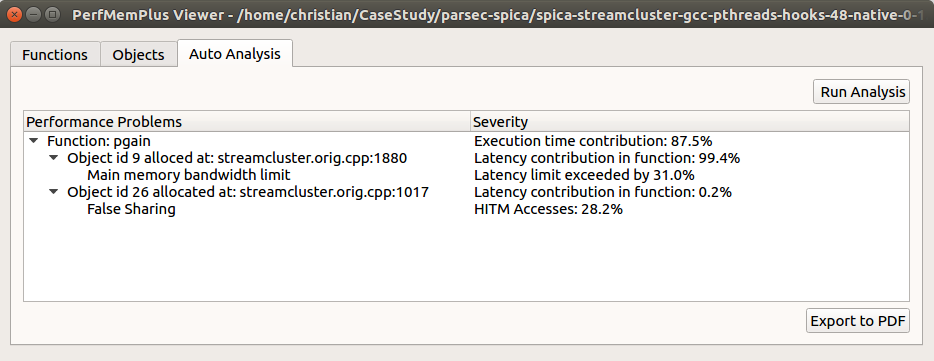

# Performance Analysis Tools

Software rarely achieves the peak performance of a processor. Performance
optimization and adjustments to specific architectures are a common task in
high-performance computing. Often we ask ourselves why the performance lower
than expected or why the application does not scale when using many cores.

Because performance problems are hard to find, analysis tools often used. Such
tools can help programmers to understand the performance relevant issues
within a program. In current systems, the memory is often the bottleneck and
it requires knowledge and effort to use the memory system in a way to achieve
the best performance.

We work on such tools that can help to find performance problems and
optimization opportunities in complex code. Such tools can help to explain
what exactly is going on inside the processor and how exactly it executes the
code. To gather information about how software is executed and to know what
the hardware is doing we use performance counters and instruction sampling.

Performance counters are a hardware feature that allows us to count the
occurrences of certain events. For example, the number of cache misses the
number of divide operations and many more. In total there are hundreds of
events available to count on modern processors. Instruction sampling is
another hardware feature that allows us to sample certain types of
instructions and events. It allows precise attribution of events to functions,
source code lines data.

The challenge in developing useful tools is to first to decide what to measure
out of the vast amount of options and second to interpret the results. It is
usually not possible to draw conclusions about performance problems from the
raw data.

We work on tools that help users to configure useful events and help to
understand the recorded data. For example, the data can be used to
automatically identify problems such as false sharing or main memory bandwidth
contention.

We have implemented a performance analysis tool which is based on Linux Perf.
Perf is a very powerful, general-purpose performance analysis tool, but the
event selection and data interpretation is the challenge. We have developed a
few tools around Perf that help us to capture the data required for analyzing
memory problems and analyze the data using a GUI.

Finding performance problems by manual exploration of the data is possible. We
have also developed an automated detection method for certain performance
problems. There are still many aspects in the available to performance data
that are not or only partly used by existing tools.

