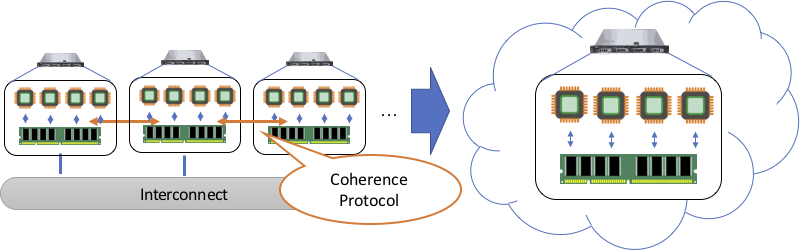

# 高性能インターコネクトを活用した分散共有メモリ

田浦研究室ではコンピュータプログラムの高速化に長年取り組んでいますが，
ここでは主に並列分散システムによる高速化，さらに踏み込むと分散共有メモリやその周辺技術について述べます．

コンピュータと一口に言っても，世の中には様々なアーキテクチャのマシンが存在します．
皆さんにとって身近なのはパソコンやスマホなどの個人用の端末だと思いますが，
例えばウェブサービスの運用などにはサーバ機という大きめの計算機が使われることが多いです．
サーバ機は多くの場合「ブレードサーバ」と呼ばれるような板状になっていて， データセンターなどではこれをたくさん並べてクラウドサービスなどに利用されています．

世の中で使われているアプリケーションにも色んな種類があって， 皆さんが普段使っているようなウェブブラウザのようなものもありますが，
一例としてウェブサービスなどでは大量のデータを処理できる データベースといった需要があるので，サーバ機ではより高性能な計算機が求められます．
皆さんにはあまり馴染みがないかもしれませんが， 例えば天気予報や工業製品の開発において現実の物理現象をシミュレーションする需要もあって，
こうした分野（科学技術シミュレーション）では特に莫大な量の計算を実行できるマシンが必要となります．
明日の天気を予報するのに計算が2日かかってはダメなわけですから，性能は重要なわけです．
そして，科学技術シミュレーションの高速化を主な目的として運用されているのが， 「 **スーパーコンピュータ** （いわゆる **スパコン**
）」と呼ばれるタイプの巨大な計算機です． 東大でもスパコンをいくつか運用していて，大学の研究活動などに役立てられています．

スパコンがどの程度の計算能力かを測るのには， 単位時間あたりにどれぐらいの浮動小数点数の計算ができるかを示す FLOPS（Floating-point
Operations Per Secondの略）という指標を使うことが多いです． 例えば最近のデスクトップ用CPUは大体400 **G**
FLOPSぐらいの値が出るようですが， 現在の世界最速のスパコン (Summit) は143 **P**
FLOPS[^1]ですから，その尋常でなさが分かると思います． ちなみに，この計算能力を出すためにはCPUだけでなく
アクセラレータと呼ばれる種類の異なったアーキテクチャを併用するケースが最近多いのですが， いずれにしてもただのパソコンとは桁が違う能力を持っているわけです．

現代的なスパコンは大量のブレードサーバを並べて作られていて， 見た目は普通のデータセンターと大差ないのですが，
ハードウェア・ソフトウェア双方に様々な違いがあります． まず，ハードウェアとしては計算コア数が比較的多く，数十コア程度のサーバ用CPUが使われています．
皆さんのパソコンはせいぜい十数コア程度ですから，この時点で計算能力は大きく違いますが， 実はCPUの周波数は大体同じ（かむしろ低い）値に設定されています．
そして，ブレードサーバにCPUやメモリその他色々を詰め込んで並べるわけですが， スパコンに特徴的なのは大量のサーバ（計算ノードと呼びます）を
超高速なネットワーク（ **インターコネクト** と呼びます）でつなげて， 一つの巨大なアプリを並列に実行するところです．
それぞれのサーバ群は物理的には独立していてCPUもメモリもばらばらなので， 一つのアプリを実行するだけでもインターコネクト越しに通信が必要です．
現状だとこの通信はシステムではなくアプリ開発者が何とかすることになっていて， **Message-Passing Interface (MPI)**
という規格に基づいて通信を記述するスタイルが主流です．

並列プログラミングをかじったことがある人なら分かると思いますが， パソコン上であるプログラムを並列化するとしたら，
スレッドを複数立てて計算する（マルチスレッドを使う）ということになります． パソコン上だとメモリは1つしかなく[^2]，
スレッド間ではメモリ（あるいはそれに対応するアドレス空間）を共有して データをやりとりできるので，これを「 **共有メモリ** 」と呼びます．
MPIはこれとは違っていて，計算ノード間で物理的にメモリが分かれていることを前提にアプリを書くので，
データをやり取りする必要があれば必ず通信を記述することになっています． こうしたメモリモデルは「 **分散メモリ** 」と呼ばれます．
ただのパソコンとはメモリモデルがそもそも違うので， スパコンを使ってアプリを速くしたいと思ったら，
スレッドを使うだけではだめで分散メモリとして丸ごと書き直す必要があるわけです．

一般的な感覚としては，同じく並列化の手法であっても，MPIを使った分散メモリよりは，
共有メモリでマルチスレッドプログラミングをした方がアプリの記述が簡単だといえるでしょう．
MPIプログラムというのは通信で発生するネットワーク遅延などを意識して記述され， 同じアプリでも逐次プログラムとは大分異なった冗長なものになります．
しかし，スパコンの性能を引き出してシミュレーションを高速化したいなら 現状では分散メモリ用にプログラミングするしかないので，
性能のために記述性・生産性を諦めているということになります． これはアプリ開発者にとっては大変な状況で，だからシステムの側で何とかしないといけない，
という発想は昔からあって，MPIよりも簡便なシステム ( _MPI alternatives_ ) について様々なアプローチで模索が続いてきました．

## 分散共有メモリとは

アプリ自体は共有メモリの形で生産的に記述しつつも， 実際には分散メモリシステム上で高速実行できるシステムを作る，
という考え方が1980年代ぐらいからあって， こういう形態のシステムを「 **分散共有メモリ (Distributed Shared Memory,
DSM)** 」と呼びます． スパコン上だと実際のところメモリは共有されていないので， その上で「あたかも共有されているかのように」見せるために
システムが自動的に通信を行うわけです． DSMとは，共有メモリのインターフェイスを分散メモリシステムで 仮想化 (virtualization)
する技法であると捉えられ， ハードウェアでもソフトウェアでも実装することができます． 当初は性能と生産性を両立できるシステム形態として注目されたのですが，
数十コア程度ならまだしも，それ以上のシステムできちんと性能を出す （＝スケールさせる）ことが難しいと分かってきたため，
次第に研究者が諦めていったという世知辛い事情があります．

DSMに代わって2000年代にMPI alternativesの一つとして登場してきた考え方が， **Partitioned Global Address
Space (PGAS)** と呼ばれるものです． PGASは基本的に共有メモリ"的"なコンセプトに近く，
共有しているアドレス空間"的"（グローバルメモリ）なものが存在して， そこに読み書きできるということは共有メモリと一緒です．
しかし，PGASではグローバルメモリとは別にローカルメモリという概念が存在して，
グローバルメモリへの読み書きは各計算ノード上でキャッシュされずに必ず通信を発生させる， という点において共有メモリとは明確に異なっています．
これに対して，共有メモリというのはアドレス空間全体がグローバルメモリで， 通信がいつ発生するかをシステムが自動的にうまくやる，
ということが前提になっています． システムがやる仕事の範囲は共有メモリよりPGASの方が少ないので，
PGASの方が「速いシステム」を開発することが簡単ですが， アプリ開発者の負担は当然PGASの方が大きいわけです．

田浦研究室でもこうした状況に対して複数の立場で挑戦を続けてきていて， 「よくあるただのPGASシステムだけではアプリの記述がそれほど簡単にならない」
という考え方を継承してきています． MPIより簡単だと言っても， グローバルとローカルのメモリ空間をアプリ開発者が意識して使い分け，
グローバルには通信コストがどうこう，というのはそれなりに難しいメモリモデルですし， 逐次プログラムとの見た目も大分変わってきます．
グローバルメモリのキャッシュを完全に諦めるという発想も， コンピュータは本来あらゆる階層でキャッシュを活用して高速化しているわけで，
ここだけそれが正しいと言い切れるようなものではないでしょう． そうした前提から現在取り組んでいるのが，PGASではなくあえて
過去の遺物のように見なされているDSMシステムを開発して， MPI alternativesの現状に一石を投じようというところなのです．
田浦研究室はソフトウェアの研究が主なので， ここから議論するのも主にソフトウェアDSMシステムの話です．

## 分散共有メモリの実装と高速化技法

実際のところ，なぜ高速なDSMシステムがこれまで実現されなかったのか， その理由自体が正しく解明されていないというのが実情です．
それらしい理由を挙げることは多くの人が行っていて， ソフトウェア実装ではOSのオーバーヘッドが発生するとか， 後に述べるように **"ディレクトリ"**
が問題だとか，色んな説がありますが， 本当に共有メモリそれ自体の問題だと言い切れるかあやしいと言えます．
一般論として，DSMの開発というのはメモリシステムを丸ごと作る話なので， 様々な実装上の性能問題に引っかかりやすくスケールしにくい，
ということは言えるでしょう．

共有メモリシステムについて考える上で最初に重要なのは， 何を持ってメモリが「共有」されていると捉えるかです．
そもそも複数コアが並列に走っているシステムというのは， コアごとに分離したキャッシュ機構をどこかしらに持っているのが普通で，
一瞬切り出して考えるとコア同士で全く同じメモリを管理しているわけではないのです． 実際のところ，共有メモリというのは「プログラムからは _あたかも_
共有されているように見えればよい」わけですから， システムとしてはそのように裏でゴソゴソやることが往々にして可能なのですが，
この辺りのルールを明確にしないとプログラムを記述することがそもそも難しくなります． そこで，「共有されたメモリから読み出される値」を正しく定義したものが
**メモリコンシステンシモデル** と呼ばれ， これはDSMについて考える上でも極めて重要な概念です．
コンシステンシを明確にしなければ，共有メモリ上で果たして正しく動く並列プログラムなのか， 全然保証がないような状況に陥るからです．

メモリコンシステンシについても色んな提案がなされていますが， 「 **"データレース"**
が無いプログラムを前提とする」という発想が現在の主流になりつつあります． データレースというのは，同じメモリアドレスに複数コアが同時に読み書きする状況[^3]
を指し，こういった状況では「何が読み書きされるのか実行時にたまたま決まる」ような非決定的な事態が起きます．
こうした状況というのはそもそもまともな計算ができないはずですし， 逆に言うと「アプリにデータレースがない」ように記述されていれば，
並列プログラムが決定的な動作をすることを簡潔に説明できるのです． さらに，データレースがそもそも無いアプリに対しては，
システムがその性質を使ってメモリを高速に管理できるという性能上うれしい点もあって， DSMにおいても同様にこの考え方は活用できるわけです．

DSMの性能問題への一つの対処として，ディレクトリを排除して **タイムスタンプ** を使う，
という手法に着目して研究を進めているので，まずこのディレクトリというものについて説明します．
共有メモリシステムはコンシステンシモデルに基づいてプログラムを実行するので，
「このデータが今必ず読まれないといけない」となったらその通りに実行しなければなりません． そこで，マルチコアプロセッサでもDSMでも，
メモリ書き込みが発生した時に他のコアにあるキャッシュを全部"無効化"して， 古いキャッシュを捨てさせることで新しいデータを送り込むということをします．
この時，書き込む側は「他のどのコアが今キャッシュしているか」を特定する必要があるので，
そのために"ディレクトリ"というデータ構造にそれらのコアを記録することで実現するわけです．

ディレクトリというのはよく使われる手法ですが， 書き込み側が読み込み側のコア全部を無効化して回らないといけないので，
コアを増やすほど通信が増える問題があります． そこで，書き込み側の負担を減らす代わりに，読み込み側のコアが
「このキャッシュを無効化しないといけない」と自発的に気づいてくれた方が うれしいという発想 (self-invalidation) があります．
そういったアイディアの一つとして興味深いのが，キャッシュ無効化にタイムスタンプを使う， それも論理的な意味でのタイムスタンプを使う[^4]という手法です．
上述したように，結局メモリコンシステンシはシステムに対して読み書きの順序を正しく制御することを
求めているわけで，時間の概念でキャッシュ無効化を捉える方がディレクトリよりもむしろ直接的とも捉えられるわけです．
また，データにタイムスタンプで順序付けると，データの複製が同じ時点で書かれたものなのか 簡単に判定できる，という性質もシステムの高速化に役立ちます．
こうした観点から，ソフトウェアDSMにこのアイディアを応用して発展させていくことに現在取り組んでいます．

## 計算ノード間通信システムの高速化

スパコンは高速なネットワーク（インターコネクト）で計算ノードを接続している，と説明しました． DSMはそうしたインターコネクトを用いて実装されるので，
当然ながらその通信性能がDSMの性能に直結してくるわけです． この通信のインターフェイスというのは上述したようにMPIが一般的ですが，
MPIの中身はそこそこ大きいソフトウェアシステムで， 実際のインターコネクトのハードウェアに至るまでに各種オーバーヘッドがかかります．

一例として，昨今のインターコネクトだとハードウェアとしては 一秒間に約100万回程度の通信を実行することができるのですが，
実際のところこの速度はCPU側から律速されてしまうことが多く， CPUを1コアだけ通信に使ってもせいぜい10万回/秒程度までしか性能が出ないのです．
この理由として，通信を1個発行するにも，CPUで前振りの処理だけは実行しないと インターコネクトにたどり着けないという事情があります．
そこで，複数コアから並列に通信を発行したいということになるわけです．

通信処理というのは基本的に遅延が入るものなので， アプリからしたら適当にハードウェアに依頼しておいてあとは終わったら教えて欲しい，
ということになるのですが，実際にはCPU処理がしばしば必要でアプリの邪魔をしてくることになります．
そこで，通信を別スレッドに分離することでその処理も並列化してしまおうという発想があるのですが， 上述したように通信高速化には複数コアが必要なわけですから，
アプリと通信のスレッドが複数存在してコアを奪い合ってしまうと， 片方を立てるともう片方が立たないという状況が生まれてしまいます．

この問題を解決するために，田浦研究室で頻繁に取り上げている話題でもあるタスク並列処理系を用いて， タスクとして通信を適切に管理する手法を提案しています．
結局，通信というのは必要なときだけ実行されればいいわけですから， タスクとして動的にその実行を制御できればアプリと通信の両方をうまく高速化できる，
というアイディアに基づいて研究を進めています．

[^1]: <https://www.top500.org/>
[^2]: これには語弊があって，キャッシュメモリはL1（やL2）で分かれてますし，NUMAアーキテクチャなら実際にメインメモリもバラバラです．しかし，いずれにしてもプログラマから見えるメモリの「インターフェイス」は全て同じだ，というところがポイントです．
[^3]: この表現には複数の観点から語弊があって，同時とは何か，といった点をちゃんと定義する必要があります．
[^4]: <https://doi.org/10.1109/PACT.2015.12>

